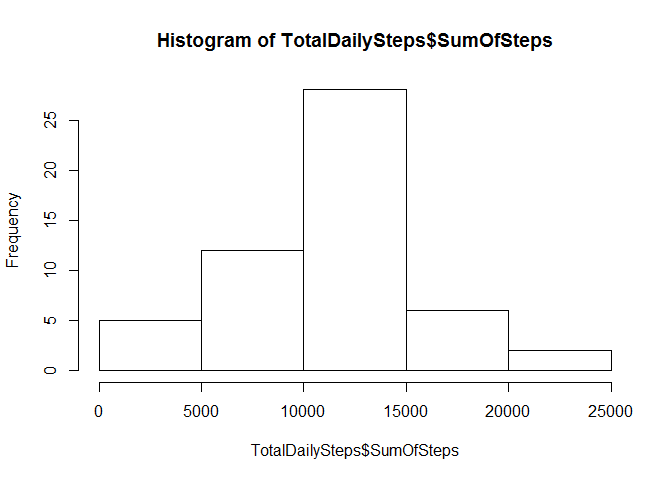
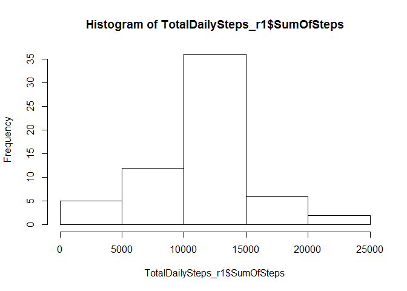
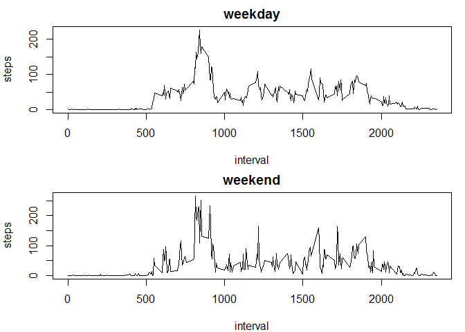

# Reproducible Research: Peer Assessment 1


## Loading and preprocessing the data


```r
library("sqldf")
```

```
## Loading required package: gsubfn
```

```
## Loading required package: proto
```

```
## Loading required package: RSQLite
```

```r
library("ggplot2")
library("lubridate")
```

```
## 
## Attaching package: 'lubridate'
```

```
## The following object is masked from 'package:base':
## 
##     date
```

```r
ActTbl <- read.csv(unzip("activity.zip","activity.csv"), header = TRUE, stringsAsFactors = FALSE)
ActTbl$ConvertedToDate <- ymd(ActTbl$date)
```

## What is mean total number of steps taken per day?

```r
TotalDailySteps <- sqldf::sqldf("SELECT ConvertedToDate, sum(steps) as 'SumOfSteps' 
             FROM ActTbl
             WHERE steps IS NOT NULL
             GROUP BY ConvertedToDate")

hist(TotalDailySteps$SumOfSteps)
```

<!-- -->

```r
mean(TotalDailySteps$SumOfSteps)
```

```
## [1] 10766.19
```

```r
median(TotalDailySteps$SumOfSteps)
```

```
## [1] 10765
```


## What is the average daily activity pattern?


```r
AverageStepsInInterval <- sqldf::sqldf("SELECT interval, avg(steps) as 'AvgOfSteps' 
            FROM ActTbl
            WHERE steps IS NOT NULL
            GROUP BY interval")

dailyAvg_MaxSteps <- sqldf::sqldf("SELECT interval, max(AvgOfSteps) as 'MaxOfSteps' 
            FROM AverageStepsInInterval")
```


## Imputing missing values


```r
MissingStepsDataRows <- sqldf::sqldf("SELECT * 
             FROM ActTbl
             WHERE steps IS NULL
             ") #GROUP BY ConvertedToDate

CountOf_MissingStepsDataRows <- sqldf::sqldf("SELECT count(ConvertedToDate) 
             FROM MissingStepsDataRows
             ") #GROUP BY ConvertedToDate

#create copy of ActTbl to update
UPDATED_ActTbl_missingAreIntervalAVG <- sqldf::sqldf("SELECT * FROM ActTbl")

#test simple update
UPDATED_ActTbl_missingAreIntervalAVG_r1 <- sqldf::sqldf(
c(
"UPDATE UPDATED_ActTbl_missingAreIntervalAVG   
SET steps = 
(SELECT AvgOfSteps 
FROM AverageStepsInInterval 
WHERE AverageStepsInInterval.interval 
= UPDATED_ActTbl_missingAreIntervalAVG.interval) 
WHERE steps IS NULL" , 
  "SELECT * FROM  main.UPDATED_ActTbl_missingAreIntervalAVG"
)
)
```

```
## Warning in rsqlite_fetch(res@ptr, n = n): Don't need to call dbFetch() for
## statements, only for queries
```

```r
TotalDailySteps_r1 <- sqldf::sqldf("SELECT ConvertedToDate, sum(steps) as 'SumOfSteps' 
             FROM UPDATED_ActTbl_missingAreIntervalAVG_r1
             WHERE steps IS NOT NULL
             GROUP BY ConvertedToDate")

hist(TotalDailySteps_r1$SumOfSteps)
```

<!-- -->

```r
mean(TotalDailySteps_r1$SumOfSteps)
```

```
## [1] 10749.77
```

```r
median(TotalDailySteps_r1$SumOfSteps)
```

```
## [1] 10641
```


## Are there differences in activity patterns between weekdays and weekends?


```r
weekdays <- c('Monday', 'Tuesday', 'Wednesday', 'Thursday', 'Friday')

UPDATED_ActTbl_missingAreIntervalAVG_r1$WeekDayClassification <- factor(
  (
    weekdays(
    TotalDailySteps_r1$ConvertedToDate
    ) %in% weekdays), 
  levels=c(FALSE, TRUE)
  , labels=c('weekend', 'weekday')
  )

#weekday average of steps in interval
AverageStepsInInterval_Weekday <- sqldf::sqldf(
"SELECT interval, avg(steps) as 'AvgOfSteps' 
            FROM UPDATED_ActTbl_missingAreIntervalAVG_r1
            WHERE steps IS NOT NULL
            AND WeekDayClassification = 'weekday' 
            GROUP BY interval")

#weekday average of steps in interval
AverageStepsInInterval_Weekend <- sqldf::sqldf(
  "SELECT interval, avg(steps) as 'AvgOfSteps' 
            FROM UPDATED_ActTbl_missingAreIntervalAVG_r1
            WHERE steps IS NOT NULL
            AND WeekDayClassification = 'weekend' 
            GROUP BY interval")
#create two panel plot of data
par(mfrow = c(2,1), mar = c(4,4,2,1))
plot(AverageStepsInInterval_Weekday$interval, 
     AverageStepsInInterval_Weekday$AvgOfSteps, 
     type = "n",
     ylab = "steps", 
     xlab = "interval",
     main = "weekday") 
lines(AverageStepsInInterval_Weekday$interval, AverageStepsInInterval_Weekday$AvgOfSteps)

plot(AverageStepsInInterval_Weekend$interval, 
     AverageStepsInInterval_Weekend$AvgOfSteps, 
     type = "n",
     ylab = "steps", 
     xlab = "interval",
     main = 'weekend') 
lines(AverageStepsInInterval_Weekend$interval, AverageStepsInInterval_Weekend$AvgOfSteps)
```

<!-- -->
